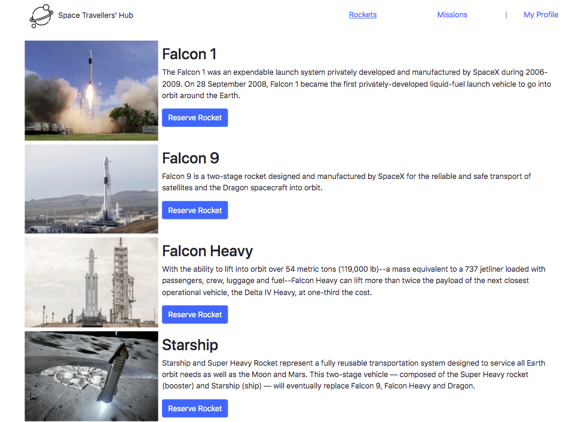

# Space travellers
> This page lets you resreve rockets and join missions from spaceX

# Live demo
You can see my page live [here](https://disc3110.github.io/space-travellers-hub)

# Screenshots

## Built With
- React
- Redux
- css3

## Getting Started
To get a local copy follow the following steps !
- open your terminal 
- clone this repo `git clone https://github.com/disc3110/space-travellers-hub.git`
- go to the repo `cd space-travellers-hub`
- Install the packages with npm `npm install`
- use `npm run start` to build dist files and run local server

## Authors

👤 *Diego Solis*

- GitHub: [@disc3110](https://github.com/disc3110)
- Twitter: [@disc3110](https://twitter.com/disc3110)

👤 *Sebastian Muñoz*

- GitHub: [@smunozmo](https://github.com/smunozmo)
- Twitter: [@smunozmo](https://twitter.com/smunozmo)

## 🤝 Contributing

Contributions, issues, and feature requests are welcome!

Feel free to check the [issues page](https://github.com/disc3110/space-travellers-hub/issues).

## Show your support

Give a ⭐️ if you like this project!

## 📝 License

This project is [MIT](./MIT.md) licensed.
